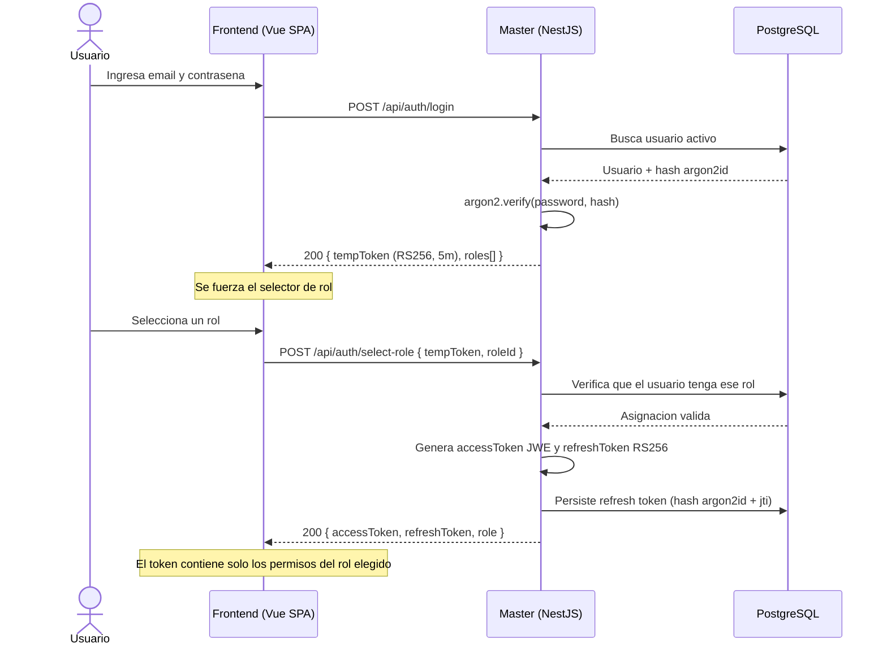
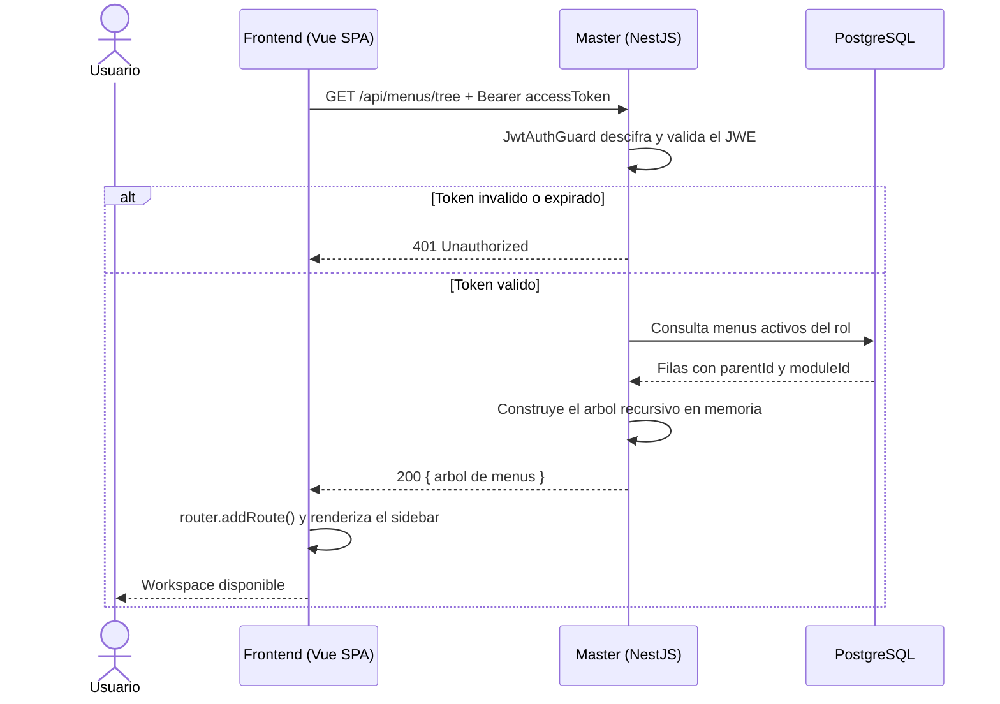
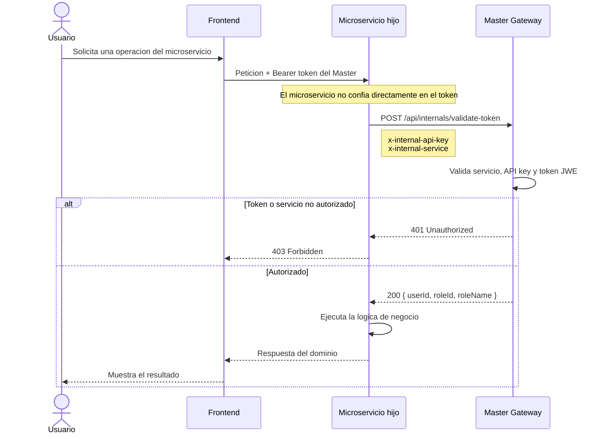
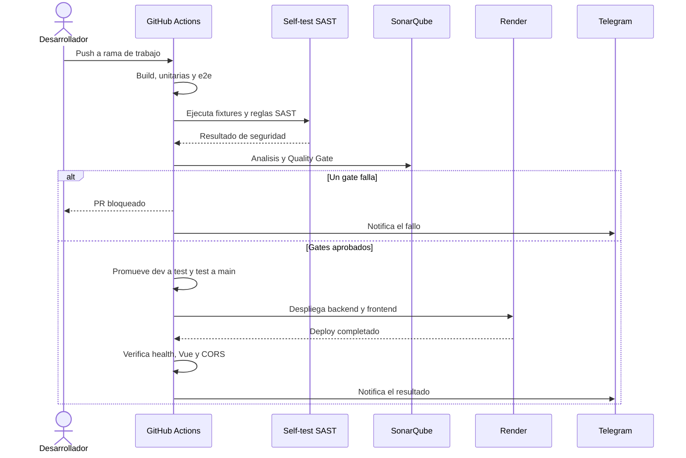
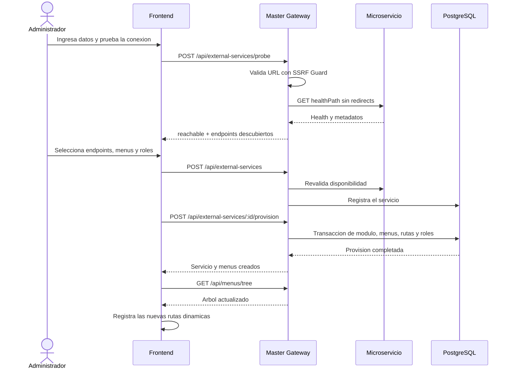

# Master Gateway - Autenticacion y Autorizacion Centralizada

Microservicio maestro full-stack que centraliza autenticacion, autorizacion basada en roles, construccion dinamica de menus y **proxy de microservicios externos** para un ecosistema Zero Trust.

## Stack

| Capa          | Tecnologia                                                                  |
| ------------- | --------------------------------------------------------------------------- |
| Backend       | NestJS + TypeScript                                                         |
| ORM           | Prisma                                                                      |
| BD            | PostgreSQL 16                                                               |
| Frontend      | Vue 3 + Vue Router (SPA, rutas dinámicas)                                   |
| Proxy         | Service Proxy dinámico (`/api/proxy/*`) con SSRF Guard                      |
| Seguridad     | JWE (RSA-OAEP-256 + A256GCM), Argon2id, Guards, DTO Validation, OPA, Helmet |
| Infra         | Docker, Kubernetes (Kustomize), GitHub Actions, SonarQube Community         |

## Inicio rapido con Docker

```bash
# Solo la primera vez: crea el archivo local y completa sus 3 secretos
cp .env.example .env

# Construye y levanta todo el sistema
docker compose up --build -d
```

No es necesario ejecutar `npm install`, `npm run build`, las migraciones ni el
seed por separado. Docker Compose construye el backend y el frontend; al
arrancar, el backend espera a PostgreSQL, aplica las migraciones pendientes y
ejecuta el seed idempotente antes de aceptar peticiones.

Abre `http://localhost:4201` cuando los contenedores estén saludables. En los
siguientes arranques basta con `docker compose up -d`; vuelve a usar
`docker compose up --build -d` cuando cambie el código o las dependencias.

> Si Docker está instalado dentro de WSL, abre una terminal de tu distribución
> Linux y ejecuta allí estos comandos de forma nativa. No antepongas `wsl` a
> cada comando.

### Restablecer toda la configuracion de seguridad

El seed normal no sobrescribe cambios realizados desde la interfaz. Para
reinicializar explícitamente los usuarios, roles, módulos, menús, sesiones y
permisos con los valores bootstrap:

```bash
docker compose exec -e SEED_RESET=true backend node backend/dist/prisma/seed.js
```

> **Advertencia:** este comando elimina primero toda la configuración de
> seguridad, incluidos usuarios y roles creados desde la interfaz. No elimina
> el volumen de PostgreSQL ni datos de otros dominios, pero úsalo únicamente
> cuando realmente quieras volver al estado inicial del seed.

Para ver el estado o detener el sistema:

```bash
docker compose ps
docker compose down
```

### Puertos

| Servicio                  | Desarrollo | Docker Compose (host) |
| ------------------------- | ---------- | --------------------- |
| Backend (Master)          | `3000`     | `3000`                |
| Frontend Vue (SPA)        | `4200`     | `4201`                |
| PostgreSQL                | —          | `5442` → `5432`       |
| SonarQube                 | —          | `9000`                |

Vite sirve el SPA en `4200` y proxya `/api` hacia el backend en `http://127.0.0.1:3000`.

## Estructura

```text
backend/
  prisma/          # Schema, migraciones y seed
  src/
    auth/          # Login, select-role, refresh, logout
    users/         # CRUD de usuarios
    roles/         # CRUD de roles y asignacion de permisos
    permissions/   # CRUD de permisos finos (resource:action)
    modules/       # CRUD de modulos
    menus/         # CRUD de menus y arbol recursivo
    external-services/ # Registro, probe y provision de microservicios (anti-SSRF)
    service-proxy/ # Proxy dinámico con validacion Zero Trust
    common/
      auth/        # Guards JWT, Roles, decoradores
      keys/        # Gestion de claves RSA para JWE
      policy/      # PolicyGuard + PolicyService (OPA)
    config/        # Validacion de entorno
    prisma/        # Servicio Prisma
  test/            # Pruebas e2e
frontend-vue/      # SPA Vue 3 con rutas dinámicas
security/
  codebert-sast/   # Agente SAST (CWE + OWASP 2025)
  fixtures/        # Código vulnerable/seguro para validar el agente
  opa/             # Políticas Rego para Open Policy Agent
k8s/               # Manifiestos Kubernetes (Kustomize + overlays dev/prod)
docs/              # Documentacion, diagramas y coleccion HTTP
```

## Funcionalidades clave

- Login con `tempToken` y seleccion obligatoria de rol antes del dashboard.
- JWT final con un solo rol activo (`accessToken` + `refreshToken`).
- Rotacion y deteccion de reuso en refresh tokens.
- CRUD de usuarios, roles, modulos, menus y **permisos finos**.
- Arbol de navegacion recursivo (`GET /api/menus/tree`) segun rol.
- **Proxy dinámico** (`/api/proxy/*path`) que reenvía peticiones a microservicios registrados, inyectando identidad del gateway y validando SSRF.
- **Registro de microservicios externos** con probe de health, descubrimiento de endpoints y provision automática de módulos, menús y rutas.
- **Policy Guard** opcional con OPA para autorización externalizada.
- Endpoint interno `POST /api/internals/validate-token` para Zero Trust.
- Auditoria en entidades con `creado_por` y `actualizado_por`.
- Endpoints protegidos con guards, validacion DTO y rate limiting.
- Claves RSA auto-generadas con rotacion via `KeysService`.

## Diagramas de secuencia

Estos diagramas representan los flujos principales implementados. La
explicacion detallada de cada flujo esta en
[`docs/diagramas-secuencia.md`](docs/diagramas-secuencia.md).

### Autenticacion y seleccion de rol



### Carga dinamica del menu



### Validacion Zero Trust



### Pipeline CI/CD



### Registro de un microservicio externo



## Endpoints principales

### Autenticacion

| Metodo | Ruta                            | Descripcion                   |
| ------ | ------------------------------- | ----------------------------- |
| `POST` | `/api/auth/login`               | Inicio de sesion              |
| `POST` | `/api/auth/select-role`         | Seleccion de rol de trabajo   |
| `POST` | `/api/auth/refresh-token`       | Rotar refresh token           |
| `POST` | `/api/auth/logout`              | Cerrar sesion                 |
| `POST` | `/api/internals/validate-token` | Validacion interna Zero Trust |

### Gestion

| Metodo | Ruta                    | Descripcion                  |
| ------ | ----------------------- | ---------------------------- |
| `GET`  | `/api/users`            | Listar usuarios              |
| `POST` | `/api/users`            | Crear usuario                |
| `GET`  | `/api/roles`            | Listar roles                 |
| `POST` | `/api/roles`            | Crear rol                    |
| `GET`  | `/api/permissions`      | Listar permisos (ADMIN)      |
| `POST` | `/api/permissions`      | Crear permiso (SUPER_ADMIN)  |
| `GET`  | `/api/modules`          | Listar modulos               |
| `POST` | `/api/modules`          | Crear modulo                 |
| `GET`  | `/api/menus/tree`       | Arbol de menus por rol       |
| `POST` | `/api/menus`            | Crear menu                   |

### Microservicios externos

| Metodo | Ruta                                      | Descripcion                          |
| ------ | ----------------------------------------- | ------------------------------------ |
| `GET`  | `/api/external-services`                  | Listar servicios registrados         |
| `POST` | `/api/external-services`                  | Registrar nuevo servicio             |
| `POST` | `/api/external-services/probe`            | Probar health de una URL             |
| `POST` | `/api/external-services/:id/probe`        | Re-probar servicio existente         |
| `POST` | `/api/external-services/:id/provision`    | Auto-generar modulo, menus y rutas   |
| `ALL`  | `/api/proxy/*path`                        | Proxy a microservicio registrado     |

## Seed

```bash
npm run prisma:seed
```

Crea 4 usuarios bootstrap, roles, modulos y menus iniciales.

| Email                    | Password           | Rol         |
| ------------------------ | ------------------ | ----------- |
| `superadmin@example.com` | `SuperAdmin12345!` | SUPER_ADMIN |
| `admin@example.com`      | `Admin12345!`      | ADMIN       |
| `demo@example.com`       | `Demo12345!`       | USER        |
| `ventas@example.com`     | `Demo12345!`       | VENTAS      |

## Desarrollo local sin contenerizar la aplicacion

```bash
# 1. Base de datos en Docker
docker compose up -d postgres

# 2. Dependencias, migraciones y seed
npm install
npm run prisma:migrate
npm run prisma:seed

# 3. Backend y frontend (en terminales separadas)
npm run dev:backend
npm run dev:frontend
```

Abre `http://localhost:4200`, inicia sesion con `admin@example.com` / `Admin12345!` y selecciona el rol.

### Problemas comunes

| Sintoma                                                        | Causa                                      | Solucion                      |
| -------------------------------------------------------------- | ------------------------------------------ | ----------------------------- |
| `ECONNREFUSED ::1:3000` en Vite                                | Backend no corriendo                       | `npm run dev:backend`         |
| Login responde 401                                             | Falta el seed                              | `npm run prisma:seed`         |
| Proxy retorna 502                                              | Microservicio destino no disponible        | Verificar health del servicio |

## Pruebas

```bash
npm test
npm run test:e2e -w backend
```

## CodeBERT SAST

```bash
docker compose --profile security build codebert-sast
docker compose --profile security run --rm codebert-sast

npm run sast:selftest    # 16/16 casos
npm run sast:rules       # escaneo con reglas
```

## Kubernetes

```bash
kubectl apply -k k8s/overlays/dev
```
Guia completa en `k8s/README.md`.
xd
## Documentacion

- `docs/README.md` - Indice de documentacion por categoria.
- `docs/arquitectura_alto_nivel.md` - Diagrama de componentes + modelo ER.
- `docs/diagramas-secuencia.md` - Flujos clave en diagramas de secuencia.
- `docs/endpoints.md` - Endpoints disponibles y roles requeridos.
- `docs/seguridad.md` - Controles implementados, defensa SSRF y riesgos.
- `docs/codebert-sast.md` - Agente SAST: CWE/OWASP, fixtures y criterios.
- `docs/ci-cd.md` - CI/CD con SonarQube Community y GitHub Actions.
- `docs/zero-trust-ventas.md` - Integracion Zero Trust.
- `docs/render-deploy.md` - Despliegue en Render.
- `k8s/README.md` - Despliegue en Kubernetes.
- `docs/master-gateway.http` - Coleccion HTTP.

## Licencia

UNLICENSED - Proyecto academico ESPE.

## Integrantes

- **Camilo Orrico**
- **Cesar Loor**
- **Gabriel Murrillo**
- 