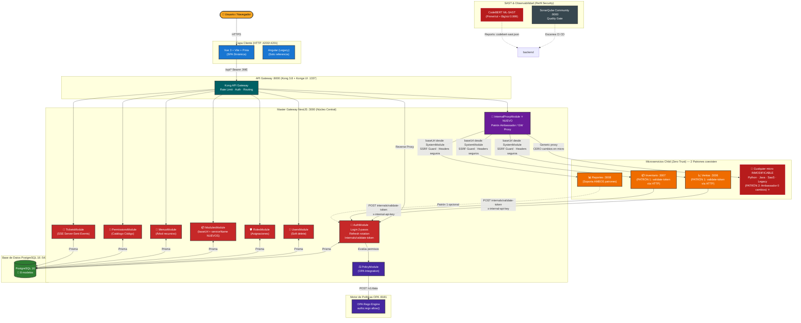
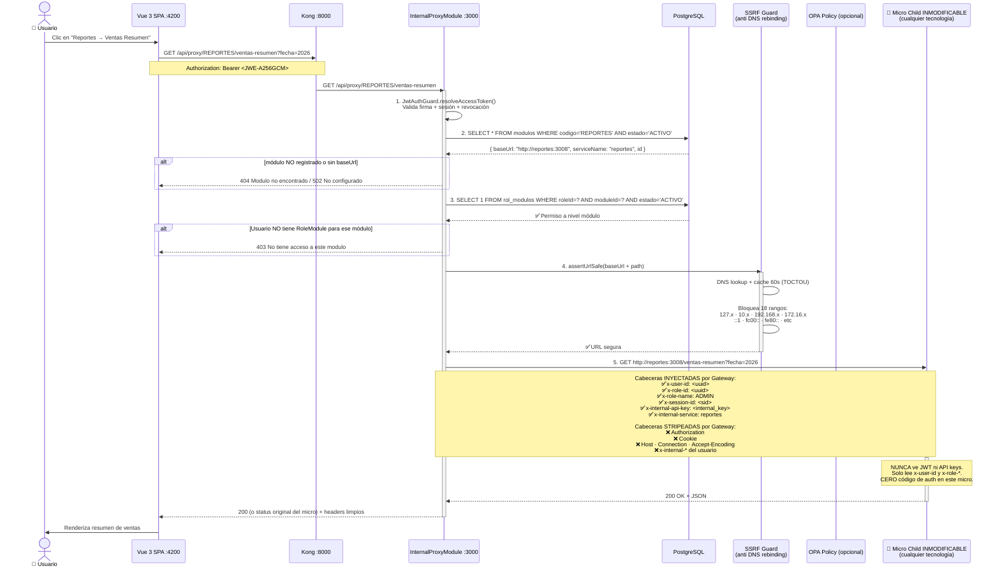
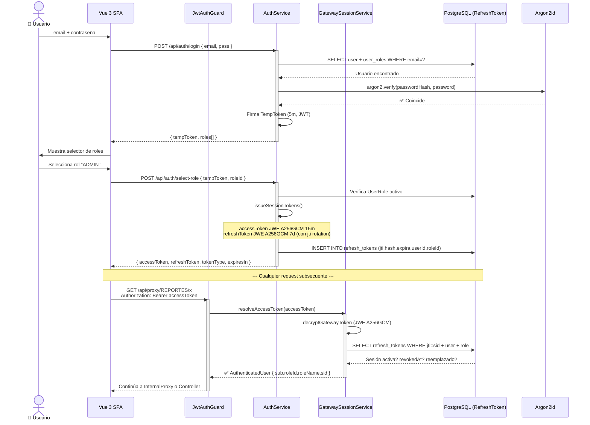
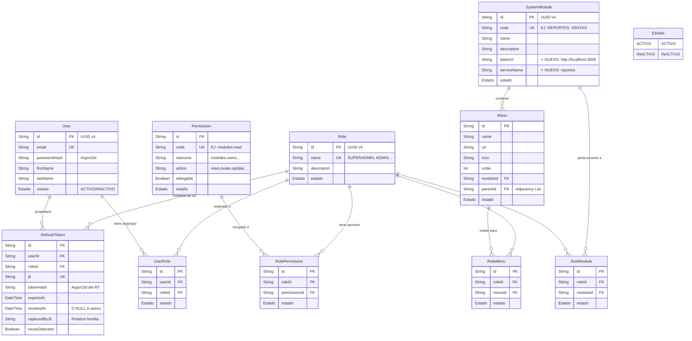
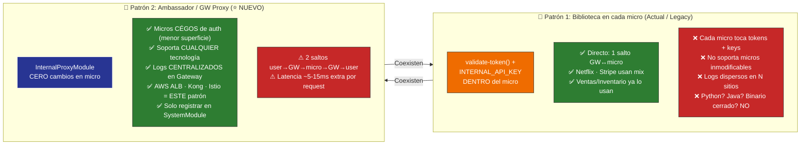
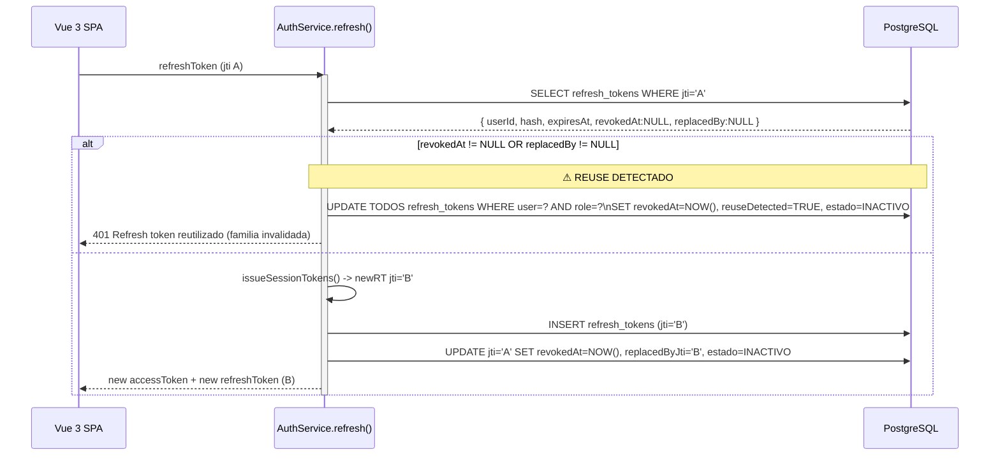

# Arquitectura Actual del Proyecto: Master Gateway

Diagramas Mermaid detallados de la arquitectura actual al 2026-07-25. Incluye el Patrón Ambassador / InternalProxy recién implementado.

---

## 1. Arquitectura de Alto Nivel (Todo el Stack)

---

## 2. InternalProxyModule — Patrón Ambassador Detallado (⭐ NUEVO)

---

## 3. Flujo de Autenticación Completo (Login 2-pasos)

---

## 4. Modelo de Datos Actualizado (con baseUrl + serviceName)

---

## 5. Comparativa de los 2 Patrones de Integración (Zero Trust)

---

## 6. Flujo de Refresh Token Rotation + Reuse Detection

