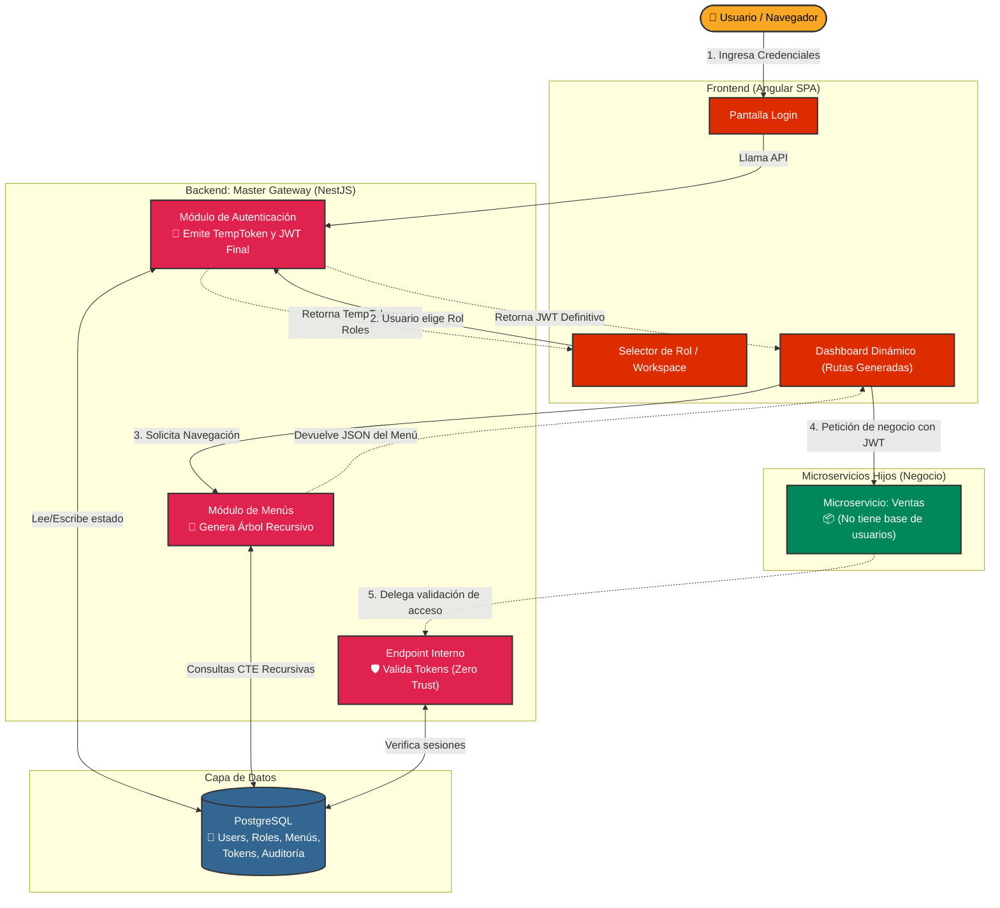

# Arquitectura de Alto Nivel: Master Gateway

A continuación se presenta un diagrama visual de cómo interactúan las distintas piezas del proyecto actualmente, basándose en la arquitectura Zero Trust y la centralización de seguridad.

### Explicación del Flujo:

1. **Autenticación en Dos Pasos**: El usuario ingresa al **Login**, el backend valida sus credenciales y emite un *TempToken* (solo válido para el siguiente paso).
2. **Aislamiento de Sesión**: Obligatoriamente, el usuario pasa al **Selector de Rol**. Una vez elige el rol con el que va a trabajar (ej. Administrador), el sistema le otorga el **JWT Definitivo** que contiene *únicamente* los permisos de ese rol elegido.
3. **Frontend Dinámico**: Con el JWT definitivo, el Angular SPA solicita la estructura de menús. El backend lee la base de datos de manera recursiva y le devuelve un JSON con el menú (Sidebar) que le corresponde, construyendo las rutas en ese instante (no hay rutas _hardcodeadas_).
4. **Zero Trust en Acción**: Cuando el usuario intenta acceder a un recurso de negocio (como el **Microservicio de Ventas**), el SPA envía el JWT. El microservicio de ventas *no confía* en el SPA ni tiene base de datos de usuarios; en su lugar, pregunta inmediatamente al Master Gateway (`ValidationService`) si ese token es válido y si tiene permisos para entrar. Si la respuesta es afirmativa, le entrega los datos al usuario.
