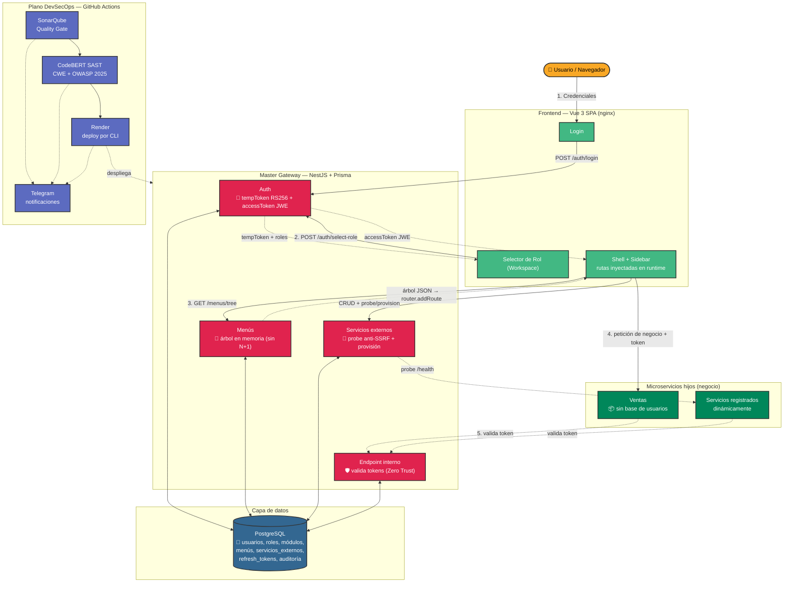
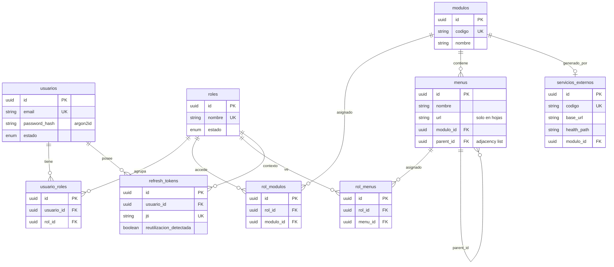

# Arquitectura de Alto Nivel: Master Gateway

Vista de cómo interactúan las piezas del proyecto: la SPA, el Master de
autenticación/autorización, la base de datos, los microservicios hijos Zero
Trust y el plano DevSecOps (CI/CD).

## Diagrama de componentes

### Flujo resumido

1. **Autenticación en dos pasos.** Login valida credenciales (argon2id) y emite
   un `tempToken` de corta vida.
2. **Aislamiento de sesión.** El usuario elige rol en el selector; el sistema
   emite un `accessToken` **JWE cifrado** con *sólo* los permisos de ese rol
   (menor privilegio).
3. **Frontend dinámico.** Con el token, la SPA pide el árbol de menús y construye
   las rutas en tiempo de ejecución (`router.addRoute`) — sin rutas hardcodeadas.
4. **Zero Trust.** Los microservicios hijos no confían en el frontend: validan
   cada token contra el endpoint interno del Master (API key + allowlist).
5. **Extensibilidad.** Nuevos servicios se registran desde la UI: se prueba su
   `/health` (con defensa anti-SSRF) antes de generarles módulo y menús.
6. **DevSecOps.** Cada cambio pasa por build, Quality Gate de SonarQube y SAST
   CodeBERT (con mapeo CWE/OWASP 2025) antes de desplegar por CLI, con Telegram
   notificando cada hito.

## Modelo de datos (entidad-relación)

Todas las entidades comparten el patrón de auditoría (`id` UUID v4, `estado`,
`fecha_creacion`, `fecha_actualizacion`, `creado_por`, `actualizado_por`) y usan
soft delete. Los menús son una lista de adyacencia (`parent_id` a sí misma).

Los diagramas de secuencia de cada flujo están en
[`docs/diagramas-secuencia.md`](./diagramas-secuencia.md).
