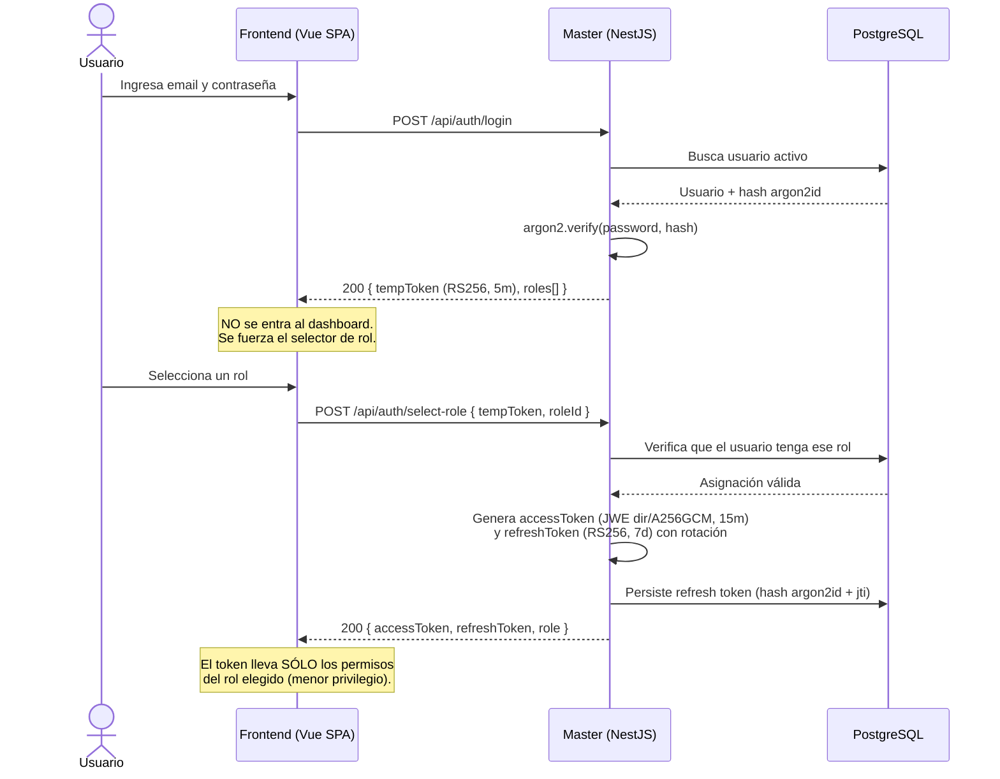
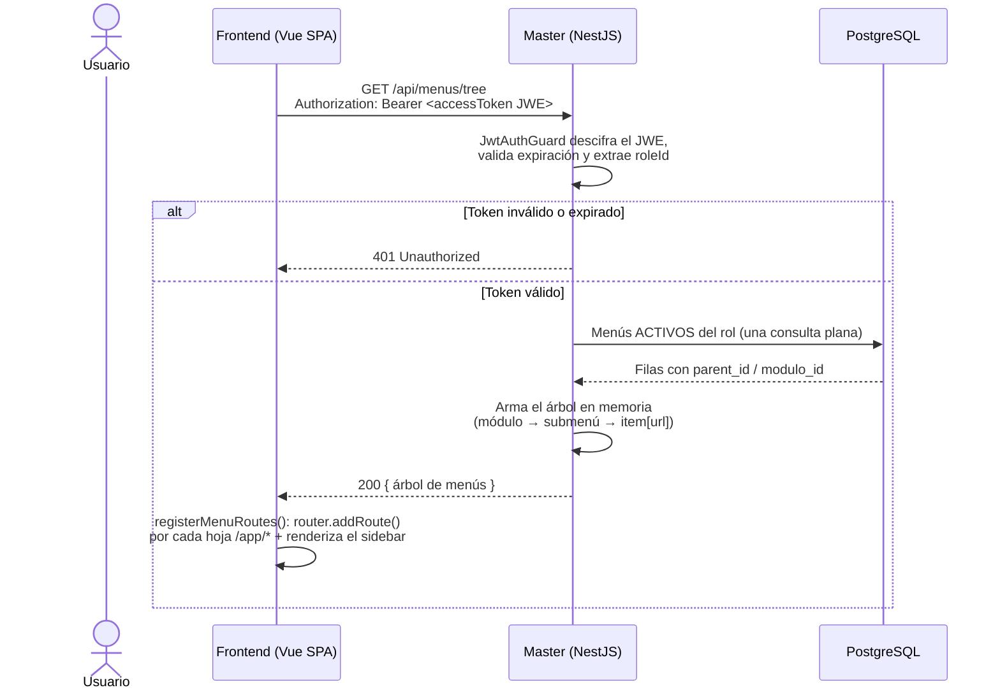
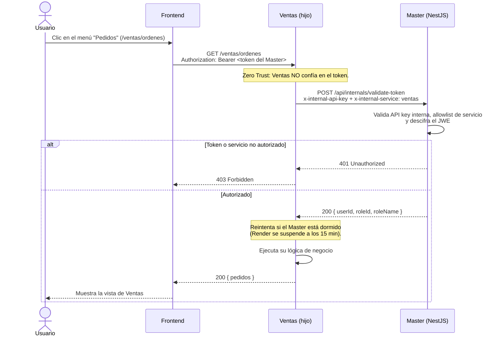
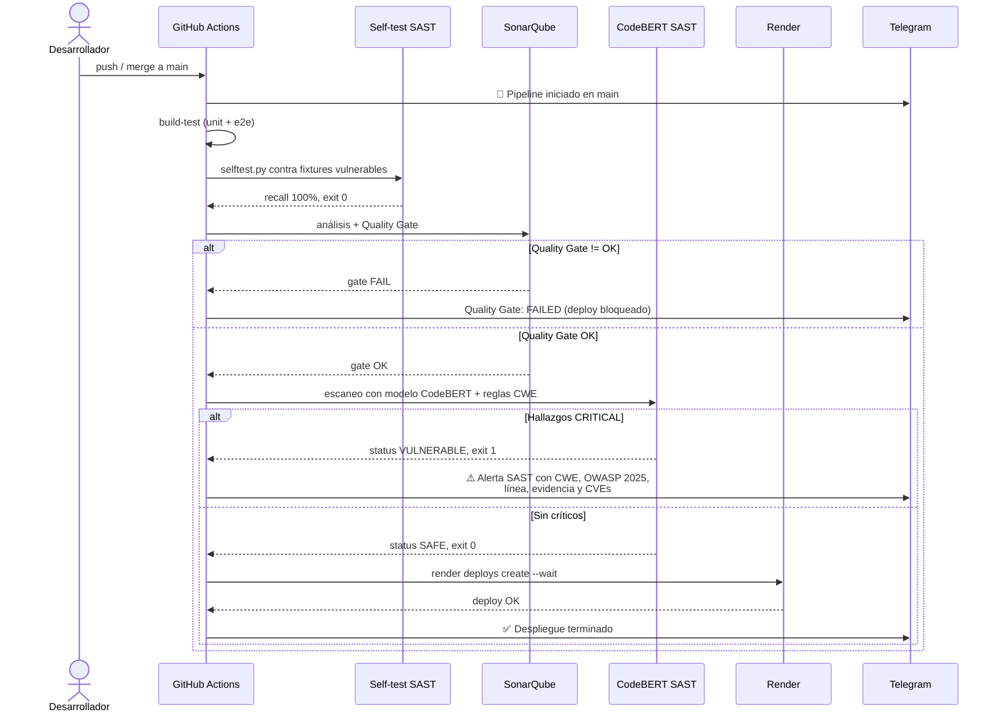
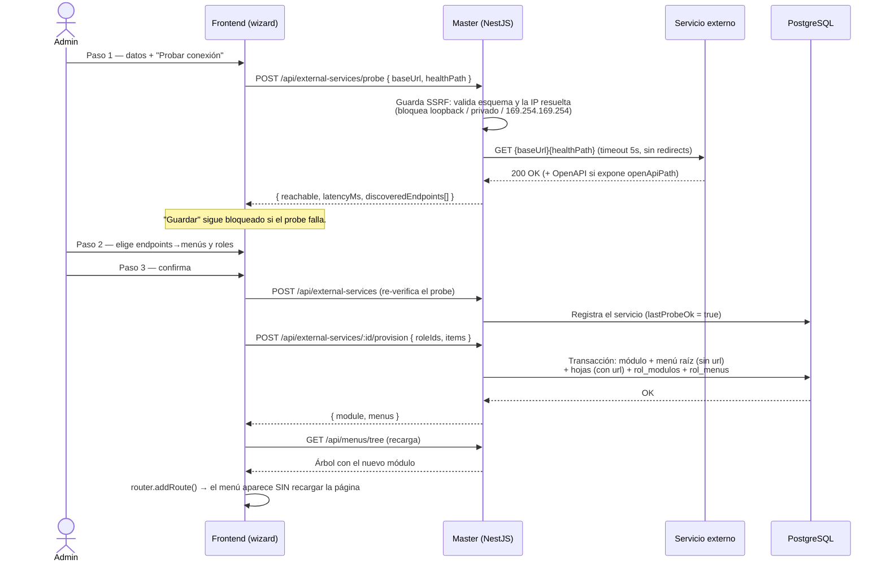

# Diagramas de secuencia

Los diagramas §8 del enunciado, más el flujo de registro de microservicios
externos. Reflejan la **implementación real**, no la figura idealizada: donde el
proyecto se desvía del PDF (token JWE en vez de JWT firmado, árbol de menús
armado en memoria en vez de CTE), se indica explícitamente.

## 1. Autenticación y selección de rol

Login en dos fases: credenciales → `tempToken` (RS256, 5 min) → selección de rol
→ token de acceso. El token de acceso es un **JWE cifrado (`dir` + `A256GCM`)**,
más fuerte que el JWT firmado que pedía el PDF: el contenido va cifrado, no sólo
firmado.

## 2. Carga dinámica del menú recursivo

El frontend pide el árbol tras seleccionar rol y, con él, **inyecta las rutas en
tiempo de ejecución** (`router.addRoute`), sin rutas hardcodeadas.

> Nota de implementación: el enunciado sugería una CTE recursiva
> (`WITH RECURSIVE`). La implementación real hace **una sola consulta plana** de
> los menús del rol y arma el árbol en memoria (`menus.service.ts`). Cumple el
> requisito de rendimiento (sin N+1, una query, portable entre motores) sin
> `WITH RECURSIVE`. Ver `docs/modelo-datos.md`.

## 3. Integración Zero Trust con el microservicio hijo (Ventas)

El microservicio de ventas **no confía en el frontend** ni tiene base de usuarios:
valida el token contra el Master en cada petición.

## 4. Pipeline CI/CD (DevSecOps)

Flujo del anexo: build → SonarQube gate → SAST CodeBERT (con CWE/OWASP 2025) →
deploy por CLI, con notificaciones a Telegram en cada hito.

## 5. Registro dinámico de un microservicio externo

Alta de un servicio hijo: se prueba que responde **antes** de crearle módulo y
menús, con defensa anti-SSRF en el probe.

